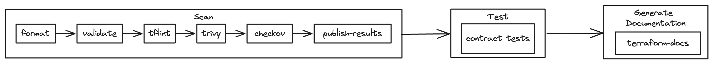
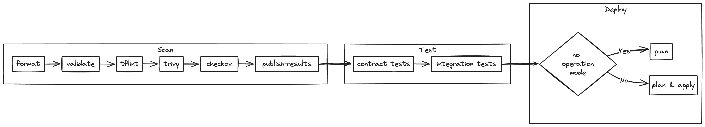

# terraform-template-repo

An opinionated template repository designed to streamline Terraform projects.

## Purpose

The purpose of this repository is to simplify the setup and management of Terraform projects. It offers the following key features:

- **Modular structure:** The repository is organized into logical modules to help you easily navigate and manage Terraform configurations.
- **Automated workflows:** The repository comes with a set of automated workflows to streamline the development process.

## Layout

### Terraform

The `terraform/` folder contains two subfolders: `environments/` and `modules/`.

The `environments/` folder is where one can define different environments (e.g., development, staging, production) with their respective Terraform configurations. Each environment acts as a Terraform root module.

The `modules/` folder provides a dedicated space for organizing reusable Terraform modules that can be shared across environments. Each module acts as a Terraform child module.

### Workflows

The `.github/workflows/` folder contains a set of automated workflows to streamline the development process. In particular, the following capabilities are provided:

- Continuous integration
- Deploy infrastructure
- Destroy infrastructure
- Generate documentation

## Contributing

Information about contributing to this project can be found [here](/CONTRIBUTING.md).

## License

Released under [MIT](/LICENSE) by [@christosgalano](https://github.com/christosgalano).
