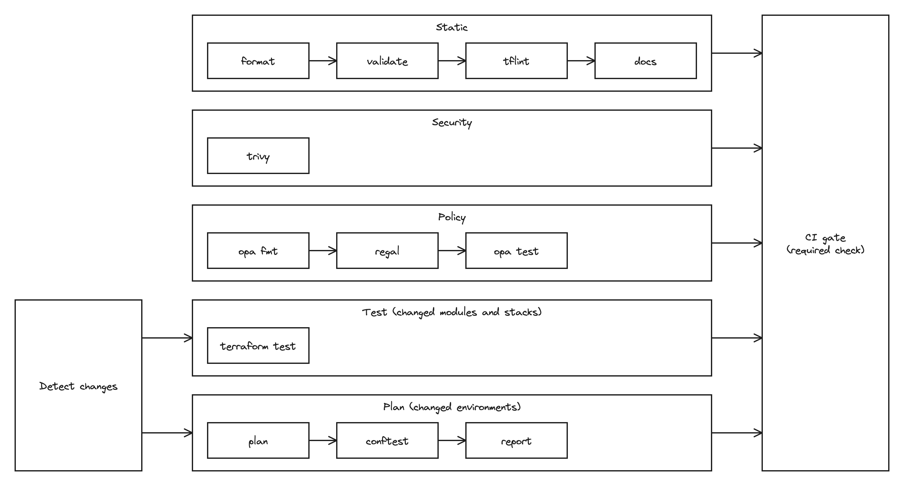
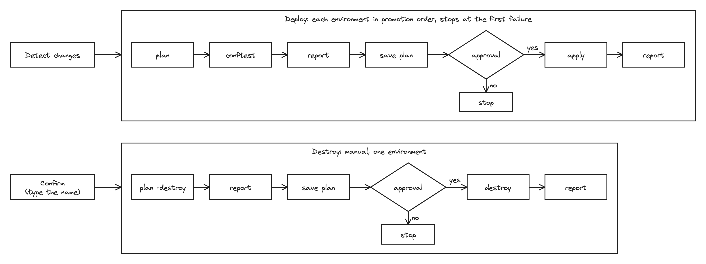

# terraform-template-repo

A cloud-agnostic template for Terraform projects, with the delivery pipeline already built: every change is checked, planned and policy-tested on the pull request, and applied after merge from the exact plan that was reviewed.

It ships with a placeholder resource (`terraform_data`), so it runs end to end with no provider or credentials. Replace the placeholders with your own code.

## Layout

```text
terraform/
  modules/       small single-purpose modules
  stacks/        wire modules together once
  environments/  one root module per environment: backend, provider, values only
policy/          OPA policies evaluated against the plan
.github/
  workflows/     ci, cd, deploy (reusable), destroy
  actions/       terraform-setup, terraform-plan, terraform-report
  scripts/       changes.sh: what a change touches
```

An environment never holds wiring. It calls a stack with its own values, so adding an environment means copying a thin folder instead of a drifting copy of the infrastructure.

Modules and stacks have unit tests in `tests/` (`terraform test`, mocked providers). READMEs are generated by terraform-docs between the `BEGIN_TF_DOCS` markers; write above them.

## Pipeline

**CI** runs on every pull request. A single **CI gate** check, the one you require in the branch ruleset, depends on:

- format, `validate`, tflint, and up-to-date docs;
- a [Trivy](https://trivy.dev) misconfiguration scan, any finding fails (suppress inline with a reason and an expiry);
- policy lint and unit tests;
- `terraform test` for changed modules and stacks;
- a plan per changed environment, with policy checked on that plan.



**CD** runs after a merge to main. Affected environments go one at a time in promotion order (`development`, `staging`, `production`) and stop at the first failure. Each one re-plans, re-checks policy, waits for approval on its GitHub Environment, then applies the saved plan. If state moved in between, Terraform rejects the stale plan instead of applying something else. Run it by hand with the **CD** workflow.



**Destroy** is manual: confirm by typing the environment name, review the destroy plan, approve on the environment.

Every plan and apply is written to the job summary, and PR plans also to a sticky comment: the summary line, one line per resource (`+` create, `-` destroy, `!` update or replace, failed resources included) and, for plans with changes and for failures, the full output (collapsed).

### What runs when

`changes.sh` keeps CI and CD to what a change touches:

| Change | Tests | Plans |
| --- | --- | --- |
| `modules/<m>` | `<m>` and every stack | every environment |
| `stacks/<s>` | `<s>` | every environment |
| `environments/<e>` | none | `<e>` |
| `tests/` folders | that unit | none |
| `policy/`, `.github/`, `trivy.yaml`, `.tflint.hcl` | none | every environment |
| `*.md` | none | none |

## Policy

`policy/` holds [Rego](https://www.openpolicyagent.org/docs/policy-language) rules that conftest runs on the resolved plan. It starts with one provider-neutral rule (required tags or labels) and the helpers to write more. See [policy/README.md](policy/README.md). For a fuller policy practice, with conventions, scenarios and bundle publishing, use [opa-template-repo](https://github.com/christosgalano/opa-template-repo).

## Make it yours

1. Create your repository from this template and replace `@christosgalano` in `.github/CODEOWNERS`.
2. In each environment's `terraform.tf`, add your provider and backend. Remote state is required for CD, because the apply runs on a fresh runner. Put shared backend settings (one `key=value` per line) in the `TF_BACKEND_CONFIG` repository variable.
3. Authenticate to your cloud in `.github/actions/terraform-setup/action.yaml`. Prefer OIDC. Plans should use a read-only identity.
4. Create the GitHub Environments `development`, `staging` and `production`. Add required reviewers (without them plan and apply run back to back), limit deployments to `main`, and keep the apply identity's credentials on the environment.
5. Require the **CI gate** check in a branch ruleset.
6. Enable your provider's ruleset in `.tflint.hcl` and add rules under `policy/terraform/<provider>/`.
7. Replace `sample_module` and `sample_stack`.

To add an environment, copy an `environments/` folder and rename its tfvars file and state key. Then add it to `ORDER` in `.github/scripts/changes.sh`, to the `environment` choices in `cd.yaml` and `destroy.yaml`, and to `vars` in `trivy.yaml`.

## Local checks

```sh
pre-commit install   # fmt, docs, opa fmt/test and trivy on commit
terraform -chdir=terraform/modules/sample_module test
opa test policy
```

The diagrams in `assets/` are Excalidraw sources with PNG exports.

## Contributing

See [CONTRIBUTING.md](CONTRIBUTING.md).

## License

Released under [MIT](LICENSE) by [@christosgalano](https://github.com/christosgalano).
