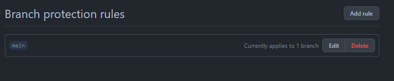
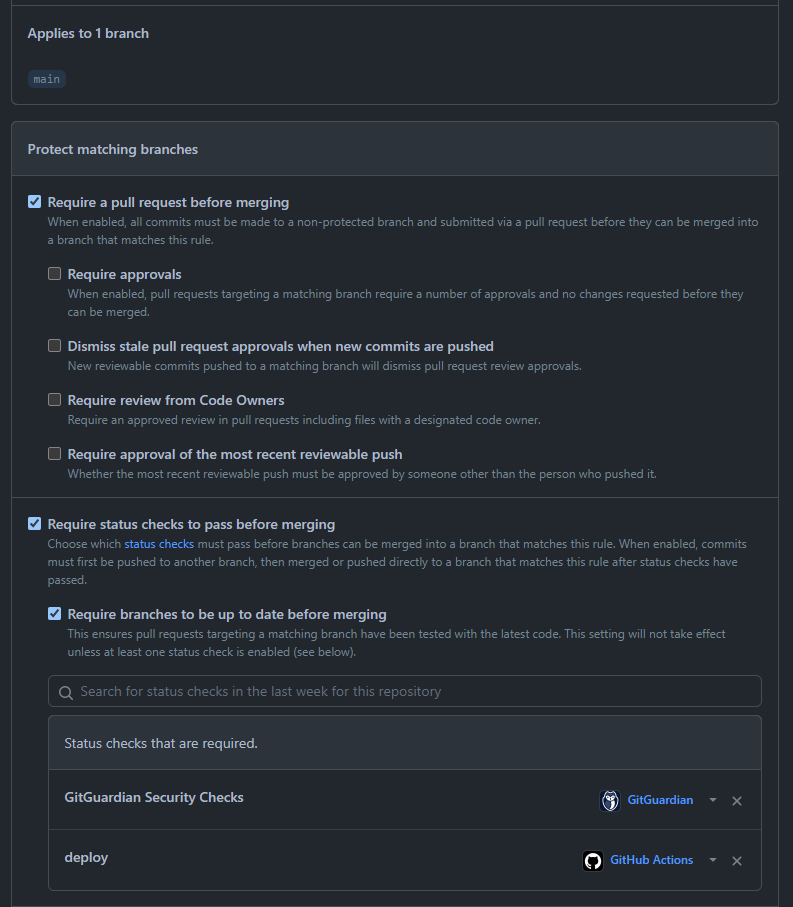

# Branch protection rules

## Proposed changes

Go to your repository's `Settings/Branches` and create a rule for the main branch.

Replicate the following rules:

The [GitGuardian](https://www.gitguardian.com/) status check is optional, but it's a great way to protect your organization from leaking sensitive information.

If your team consists of more than one member, then it is a good idea to also enable both the `Require approvals` and the `Require review from Code Owners` options.

Also, make sure to check out the `Require deployments to succeed before merging`, and see if it is something that can be applied to your case.

## Resources

- [About protected branches](https://docs.github.com/en/repositories/configuring-branches-and-merges-in-your-repository/defining-the-mergeability-of-pull-requests/about-protected-branches)
- [CODEOWNERS](https://christosgalano.github.io/github/codeowners/)
- [Integrate GitGuardian with your GitHub repository](https://docs.gitguardian.com/internal-repositories-monitoring/monitor-perimeter/vcs-integrations/github)