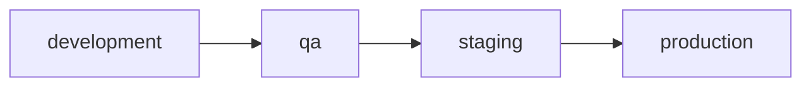

# Environment management

## Add a new environment

### Environment

Create a GitHub environment by going to your repository's `Settings/Environments`.

### Directory

Create a directory with the name of the environment in `terraform/environments`. Follow the structure below:

```bash
📦new_environment
 ┣ 📜.terraform-docs.yaml
 ┣ 📜new_environment.auto.tfvars
 ┣ 📜main.tf
 ┣ 📜outputs.tf
 ┣ 📜README.md
 ┣ 📜terraform.tf
 ┗ 📜variables.tf
```

You can copy the `.terraform-docs.yaml` from an existing environment, it requires no modifications. You can also skep the creation of the README.md since it will be automatically generated when they `deploy` workflow runs.

### Workflow

Update the [`deploy`](../.github/workflows/deploy.yaml) workflow in the `select-environments` job:

```yaml
- name: Find which environment/s changed
  if: github.event_name == 'pull_request'
  uses: dorny/paths-filter@v2
  id: filter
  with:
    filters: |
      modules:
        - '**/modules/**'
      development:
        - '**/development/**'
      staging:
        - '**/staging/**'
      production:
        - '**/production/**'
      new_environment:                  <== Added
        - '**/new_environment/**'

- name: Select environments
  if: github.event_name == 'pull_request'
  id: select-environments
  run: |
    environments=()
    if [ "${{ steps.filter.outputs.development }}" == "true" ]; then
      environments+=("development")
    fi
    if [ "${{ steps.filter.outputs.new_environment }}" == "true" ]; then        <== Added
      environments+=("new_environment")
    fi
    if [ "${{ steps.filter.outputs.staging }}" == "true" ]; then
      environments+=("staging")
    fi
    if [ "${{ steps.filter.outputs.production }}" == "true" ]; then
      environments+=("production")
    fi
    if [ "${{ steps.filter.outputs.modules }}" == "true" ]; then
      environments=("development" "staging" "production")
    fi
    environments_json=$(jq -c -n '$ARGS.positional' --args "${environments[@]}")
    echo "Selected environments: $environments_json"
    echo "environments=$environments_json" >> $GITHUB_OUTPUT
```

**NOTE**: order matters. Make sure you insert the `if` snippet in the `select-environments` step in the position where you would like for it to be executed.

---

### Example

Let's say we wish to add a new environment called `qa`.

We create a new GitHub environment called `qa`.

We create a new directory in `terraform/environments` with the following structure:

```bash
📦qa
 ┣ 📜.terraform-docs.yaml
 ┣ 📜qa.auto.tfvars
 ┣ 📜main.tf
 ┣ 📜outputs.tf
 ┣ 📜terraform.tf
 ┗ 📜variables.tf
```

Because the `qa` deployment should happen after the `development` and before the `staging`, we make the following changes to the [`deploy`](../.github/workflows/deploy.yaml) workflow in the `select-environments` job:

```yaml
- name: Find which environment/s changed
  if: github.event_name == 'pull_request'
  uses: dorny/paths-filter@v2
  id: filter
  with:
    filters: |
      modules:
        - '**/modules/**'
      development:
        - '**/development/**'
      qa:                       // order here doesn't matter but it helps visualize the desired flow
        - '**/qa/**'
      staging:
        - '**/staging/**'
      production:
        - '**/production/**'

- name: Select environments
  if: github.event_name == 'pull_request'
  id: select-environments
  run: |
    environments=()
    if [ "${{ steps.filter.outputs.development }}" == "true" ]; then
      environments+=("development")
    fi
    if [ "${{ steps.filter.outputs.qa }}" == "true" ]; then     // order here matters
      environments+=("qa")
    fi
    if [ "${{ steps.filter.outputs.staging }}" == "true" ]; then
      environments+=("staging")
    fi
    if [ "${{ steps.filter.outputs.production }}" == "true" ]; then
      environments+=("production")
    fi
    if [ "${{ steps.filter.outputs.modules }}" == "true" ]; then
      environments=("development" "staging" "production")
    fi
    environments_json=$(jq -c -n '$ARGS.positional' --args "${environments[@]}")
    echo "Selected environments: $environments_json"
    echo "environments=$environments_json" >> $GITHUB_OUTPUT
```

Possible execution flow (as mentioned [here](workflow.md)):



---

## Remove an environment

If you wish to remove an environment the process is straightforward. Simply:

- delete the GitHub environment
- delete the environment's directory
- remove the environment's appearances in the [`deploy`](../.github/workflows/deploy.yaml) workflow