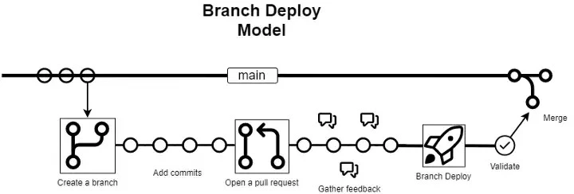
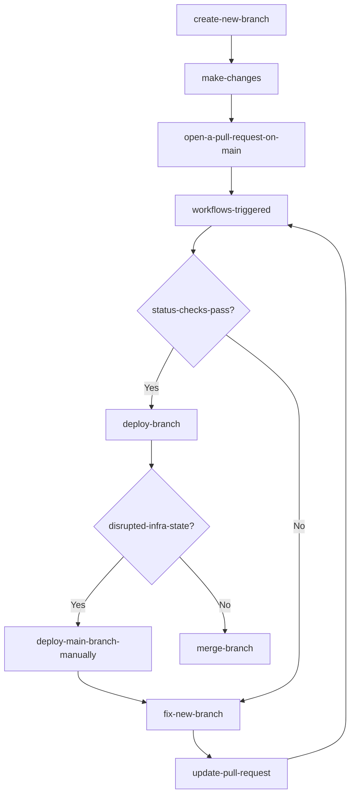

# Usage

## General

This template repository is built to take advantage of the branch-deploy model.

The most important principle that we want to preserve is the following:

> The main branch is always deployable with a reliable, desired outcome.

## Proposed flow for changes

## Resources

- [branch-deployment](https://github.blog/2023-02-02-enabling-branch-deployments-through-issueops-with-github-actions/)
- [github-flow](https://docs.github.com/en/get-started/quickstart/github-flow)
- [branch-protection-rules](branch_protection_rules.md)
- [environment-management](environment_management.md)
- [module-management](module_management.md)
