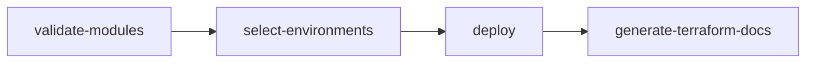
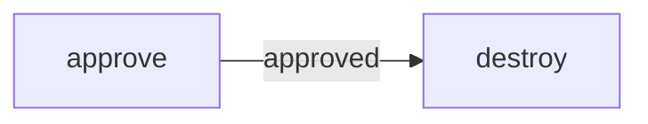
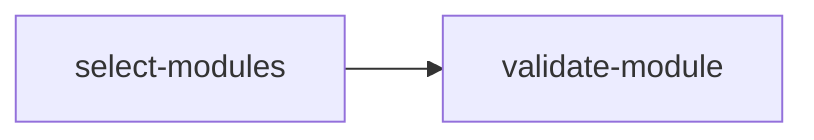

# Workflows

## deploy

### Purpose

The deploy workflow makes sure our Terraform modules are valid, selects our deployment's environment(s), deploys our Terraform code and then generates documentation for each Terraform module.

### Triggers

The workflow is triggered in two ways:

- when a pull request is created/updated on the main branch, containing changes to the `terraform/` directory
- manually from the user

### Concurrency

Cancel in progress workflows based on the following criteria:

- if the trigger was `pull_request`
- if the trigger was `workflow_dispatch` and the environment is the same

Simultaneous deployment is only allowed when the workflow it's manually triggered and targets different environments; otherwise, the most recently triggered workflow gets executed.

### Jobs

This workflow consists of 4 jobs which execute in a serial manner:



1. `validate-modules`: calls the [validate-modules](#validate-modules) workflow

2. `select-environments`: selects the environments to deploy to. The selection is based on one of the following:
   - pull request and modifications to the "modules/" directory &rarr; select all environments
   - pull request and modifications to a specific environment(s) directory &rarr; select that/those environment(s)
   - workflow dispatch &rarr; select environment from inputs

3. `deploy`: deploys our Terraform code using the `matrix` strategy. The flow of execution is as follows:
  
    ```mermaid
    flowchart LR
        development --> |success| staging --> |success| production
    ```

    At least one environment is chosen, but there are no limitations to the combinations (for example we could deploy to development and production based on the changes made). Then the execution flow would be the following:

    ```mermaid
    flowchart LR
        development --> |success| production
    ```

    One important thing to take notice of is the option `fast-fail: true`. This means that if the deployment to the development environment fails, then the whole deploy workflow fails before we make possibly harming changes to the staging or the production environment. The same thing applies if the deployment to the staging environment fails, so we avoid to make possibly harming changes to the production environment.

    The serial execution is accomplished using the `max-parallel: 1` option and inserting the environments in the desired way in the JSON array.

4. `generate-terraform-docs`: calls the [generate-terraform-docs](#generate-terraform-docs) workflow

---

## destroy

### Purpose

This workflow destroys our environment's infrastructure after getting an approval from a specific user through a manually-created issue. The environment to be destroyed must be specified when triggering the workflow.

### Triggers

The workflow is triggered in only one way:

- manually from the user

### Concurrency

Cancel in progress `destroy` workflows with the same environment selection.

### Jobs

This workflow consists of 2 jobs which execute in a serial manner:



This workflow destroys our environment's infrastructure after getting an approval from a specific user through a manually-created issue. The environment to be destroyed must be specified when triggering the workflow.

This workflow has two jobs.

1. `approve`: requires an approval in the form of an open issue. It uses the *trstringer/manual-approval* action to create an issue with a specific title, minimum approvals, and a list of approvers. The approval is required before the `destroy` job can proceed.

2. `destroy`: destroys the infrastructure of the specified environment after getting the required approval. It requires read access to repository contents and write access to the ID token for OIDC capabilities.

---

## validate-modules

### Purpose

This workflow is used to validate our Terraform modules provided we follow the mentioned [structure](structure.md).

### Triggers

The workflow is triggered in two ways:

- when called from another workflow
- manually from the user

### Concurrency

Cancel in progress `validate-modules` workflows; the most recently triggered workflow gets executed.

### Jobs

This workflow consists of 2 main jobs which execute in a serial manner:



1. `select-modules`:  selects all modules in the terraform/modules directory and exports them as a JSON array. This JSON array is passed to the second job as a matrix.

2. `validate-module`: validates each module in the JSON array. Each module is validated in a separate matrix job. This job has a `max-parallel` strategy of 5, which means that up to 5 matrix jobs can run in parallel. The `fail-fast` strategy is set to false, which means that if one or more matrix jobs fail, the rest will carry on normally and won't be canceled.

---

## generate-terraform-docs

### Purpose

This workflow generates Terraform documentation for the modules included in the repository.

### Triggers

The workflow is triggered in two ways:

- when called from another workflow
- manually from the user

### Concurrency

Cancel in progress `generate-terraform-docs` workflows; the most recently triggered workflow gets executed.

### Jobs

This workflow consists of only of 1 job:

1. `generate-terraform-docs`: generates Terraform documentation for each module. It uses the *terraform-docs/gh-actions* GitHub Action to generate Terraform documentation for each module in the repository. Also, it requires `contents: write` permission to push the generated documentation to the repository.

---

## noop

### Purpose

This workflow is designed to bypass the ["required status check" branch protection rule](branch_protection.md) for the `deploy` job. That is why it's workflow name is also `deploy`.

### Triggers

The workflow is triggered in only one way:

- when a pull request is created/updated on the main branch, but ignores changes made to the terraform directory

### Concurrency

Cancel in progress workflows (`noop` concurrency group); the most recently triggered workflow gets executed.

### Jobs

This workflow consists of only of 1 job:

1. `deploy`: consists of a single step named `Fake operation` which performs no operations at all.
